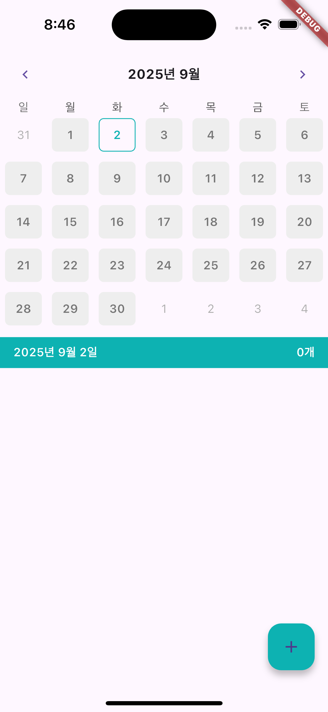
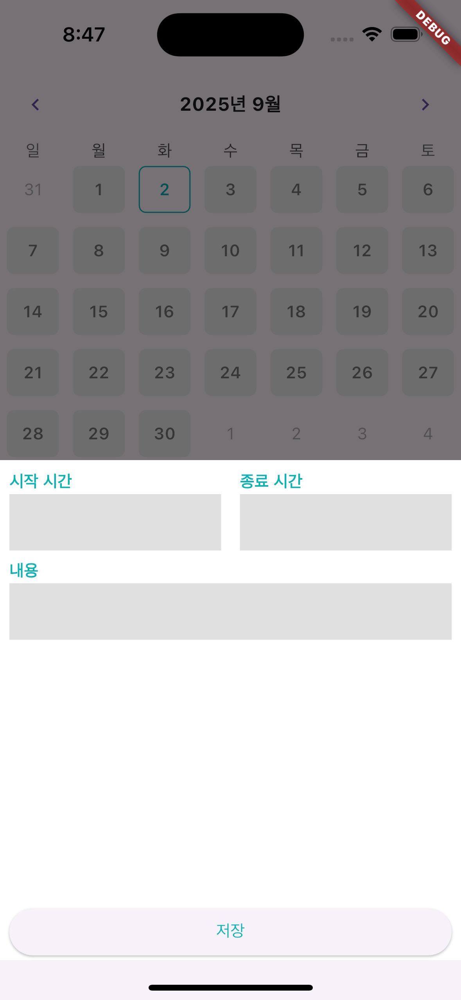
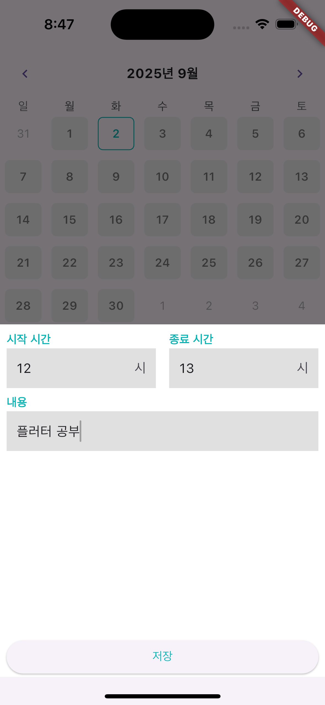
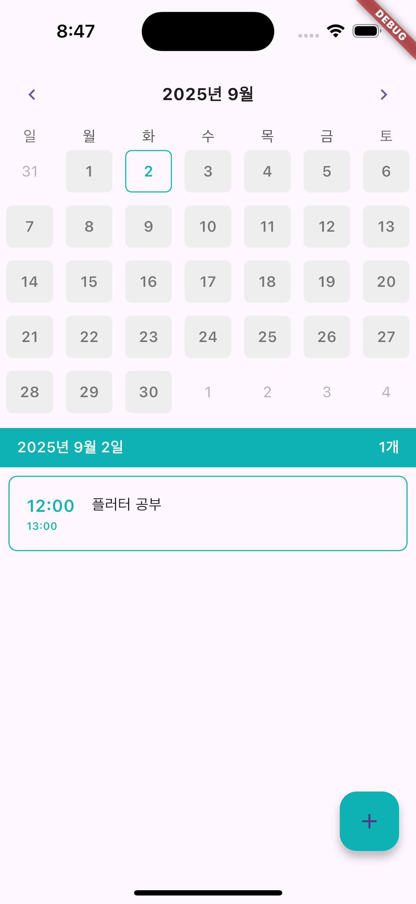

# 📅 calendar\_scheduler

깔끔한 달력 + 일정 관리 앱. 오프라인에서도 빠르게 일정 추가/조회 가능함. Drift(로컬 DB) + Provider 아키텍처로 구현.

<div align="center">

<!-- 배지들 -->


</div>

---

## ✨ 화면 미리보기 (Screenshots)


| 메인                                    | 추가 시트                                   | 입력                                    | 저장 후                                    |
| ------------------------------------- | --------------------------------------- | ------------------------------------- | --------------------------------------- |
|  |  |  |  |

---

## 🚀 핵심 기능

* 달력에서 날짜 선택 → 하단에 해당 날짜 일정 카운트/목록 표시됨
* **+** Floating Action Button → 하단 **일정 추가 시트** 열림
* 시작/종료 시간 + 내용 입력 → **저장** → 즉시 목록 반영
* Drift 로컬 DB 사용 → 오프라인에서도 동작, 빠른 조회 성능
* Provider 상태관리 + 캐시 적용(응답 지연 최소화)

---

## 🧩 기술 스택

* **Flutter** (Material 3)
* **Drift** (SQLite ORM) + `sqlite3_flutter_libs`
* **Provider** (상태관리)
* **get\_it** (DI)
* **table\_calendar** (달력 UI)
* 그 외: `intl`, `uuid`, `dio`(확장용)

---

## 📁 프로젝트 구조(요약)

```
lib/
 ├─ component/                # 공용 위젯(예: schedule_bottom_sheet.dart)
 ├─ database/
 │   ├─ drift_database.dart   # Drift 테이블/DAO 정의 (part 'drift_database.g.dart')
 │   └─ drift_database.g.dart # build_runner로 생성되는 파일(버전관리 X)
 ├─ screen/
 │   └─ home_screen.dart      # 메인 달력 + 일정 목록
 ├─ main.dart                 # DI 초기화, 앱 진입점
 └─ ...
```

---

## 🛠️ 트러블슈팅

* **`Error: Error when reading 'lib/database/drift_database.g.dart': No such file or directory`**

  * 원인: 코드 생성 파일 누락
  * 해결: `flutter pub run build_runner build --delete-conflicting-outputs`

* **CocoaPods 경고: `did not set the base configuration...`**

  * `ios/Flutter/Debug|Release|Profile.xcconfig`에 아래 한 줄씩 포함돼 있으면 정상 동작함

    ```
    #include? "Pods/Target Support Files/Pods-Runner/Pods-Runner.<config>.xcconfig"
    #include "Generated.xcconfig"
    ```
  * 경고를 완전히 없애려면 Xcode → Runner Target → Build Settings → Base Configuration에 각각 지정.

* **iOS 최소버전**

  * `ios/Podfile` 상단에 `platform :ios, '13.0'` 권장.

---

## 🔮 로드맵(예정)

* 일정 편집/삭제
* 반복 일정, 알림(Notification)
* 카테고리/태그별 필터
* 클라우드 동기화(Firebase/서버) 옵션
* 다크 모드, 접근성 개선

---

